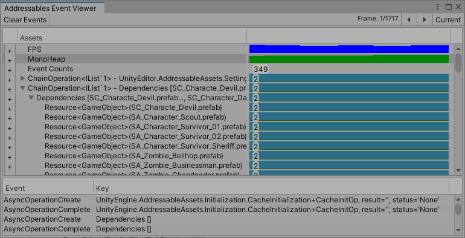
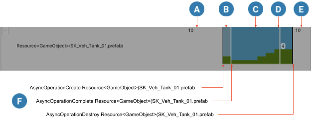

# Event Viewer

Use the __Addressables Event Viewer__ window to monitor memory management of your Addressables assets. The window shows when your application loads and unloads assets and displays the reference counts of all Addressables system operations. The window also shows approximate views of the application frame rate and the total amount of allocated managed memory. You can use these charts to detect how Addressables events such as loading and releasing assets affect application performance and to detect assets that you never release.

 Use the __Use Existing Build__ Play Mode script to get the most accurate information in the Event Viewer in Play mode. The __Use Asset Database__ script doesn't account for any shared dependencies among the Assets and the __Simulate Groups__ script gives a less accurate monitoring of reference counts.

> [!IMPORTANT] 
> To view data in the Event Viewer, you must enable the __Send Profiler Events__ setting in your [AddressableAssetSettings] object's Inspector and make a new content build. 

See [Memory management] for more information about managing the memory associated with your Addressable assets.

## Viewing Addressables events

View Addressables asset lifespan charts and events in the __Event Viewer__ window:

1. Enable __Send Profiler Events__ in your Addressables settings:
    a. Open your Addressable settings Inspector (menu: __Window > Asset Management > Addressables > Settings__)
    b. Under __Diagnostics__, check the __Send Profiler Events__ option.

2. Rebuild your Addressables content using the __Default Build Script__ from the Addressables Groups window.
3. Open the __Event Viewer__ (menu: __Window > Asset Management > Addressables > Event Viewer__).
4. Enter Play mode in the Editor.

## Viewing Addressables events in a standalone player

To connect the Event Viewer to a standalone player,  follow the steps under [Viewing Addressables Events] except for the last step where you enter Play mode in the Editor. Instead, perform the following, additional steps:

1. Open the __Build Settings__ window (menu: __File > Build Settings__).
2. Check the __Development Build__ option.
3. Check the __Autoconnect Profiler__ option.
4. Open the Unity __Profiler __window (menu: __Window > Analysis > Profiler__).
5. On the Build Settings window, click __Build and Run__.

The Event Viewer automatically connects to your standalone player and displays the Addressables events that occur.

See [Profiler overview] for more information about using the Unity Profiler.

## Event Viewer window

To access the window in the Editor, select __Window__ > __Asset Management__ > __Addressables__ > __Event Viewer__.

*The Event Viewer window*

The window has three sections:

* Toolbar:
    * __Clear Events__ button: clears all recorded frames, erasing everything in the window.
    * __Unhide All Hidden Events__: returns any asset or operation lifelines that you have hidden to their normal, displayed state. Only shown when you have hidden events. 
    * __Frame__ counter: displays the position of the frame cursor and the number of recorded frames. (If the toolbar doesn't display the __Frame__ counter, the frame cursor is at the current frame.)
    * Frame step (__<>__) buttons: steps the frame cursor through recorded frames. (You can also use the keyboard arrow keys.)
    * __Current__ button: moves the frame cursor to the current frame.

* __Assets__ display: shows profiler and lifespan charts related to Addressables operations and assets.
    * __FPS__ chart: the application frame rate.
    * __MonoHeap__ chart: the amount of managed memory in use.
    * __Event Counts__: the number of Addressables events that occurred in a frame (view the events in the __Event__ list).
    * __Instantiation Counts__: the number of calls to [Addressables.InstantiateAsync] in a frame.
    * Operation and asset lifespan charts: show when the system loads and releases operations or assets and display the reference counts. See [Asset lifespan chart].

* __Event__ list: shows the Addressable operation events that occurred in the frame.

You can click in the chart area of the window to pause your application and set the position of the __frame cursor__. The frame cursor appears in the window as a vertical line and shows summary information for the selected frame.

> [!NOTE]
> The FPS and MonoHeap charts include all factors that affect performance, not just those related to Addressable assets.

## Asset lifespan chart

The asset lifespan chart shows when an asset or operation is created, its current reference count, and when it is destroyed.

To expand the display line showing the lifespan of an asset or operation, click the __+__ button for the entry in the __Assets__ list.

To view the sub-operations or sub-assets of an entry, click the expand icon (__>__) of the parent object.

You can remove the lifeline of an asset or operation from the chart by right-clicking it and choosing __Hide Selected Events__ on the context menu. Click the __Unhide All Hidden Events__ button on the toolbar to reveal the lifelines of any hidden events.

 *An example asset lifespan and the related Addressables events*

A lifespan chart shows the following information:

 Before the asset was loaded (no display).

 The asset load is in progress (dull blue).

 The asset is loaded (blue). The green bar shows the current reference count of the asset. 

 The Event Viewer frame cursor, which shows information for the selected frame, in this case, the cursor indicates that the reference count of this asset is 4 during the selected frame.

 After the asset is destroyed and unloaded (no display).

 The events associated with specific frames (events are only shown at the position of the frame cursor).

[AddressableAssetSettings]: xref:UnityEditor.AddressableAssets.Settings.AddressableAssetSettings
[Addressables.InstantiateAsync]: xref:UnityEngine.AddressableAssets.Addressables.InstantiateAsync*
[Asset lifespan chart]: #asset-lifespan-chart
[Memory management]: xref:addressables-memory-management
[Profiler overview]: xref:Profiler
[Viewing Addressables Events]: #viewing-addressables-events